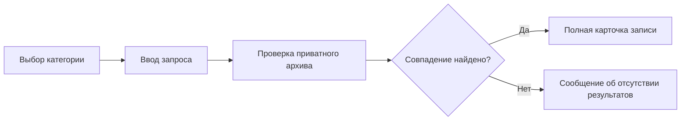

<div align="center">


# DarkNode

### Приватный инструмент для организации и поиска информации

[](#системные-требования)
[](#технологии)
[](#статус-проекта)
[](#установка)
[](#приватность)

DarkNode объединяет пользовательские записи в одном защищённом интерфейсе, сохраняет их между запусками и показывает только после выполнения поискового запроса.

[Возможности](#возможности) • [Установка](#установка) • [Приватность](#приватность) • [Разработка](#разработка)

</div>

---

## Обзор

DarkNode — компактное настольное приложение для Windows, предназначенное для создания приватного информационного архива. Пользователь самостоятельно добавляет записи, выбирает категорию и выполняет поиск по сохранённым данным.

Программа не раскрывает содержимое архива автоматически: сначала выполняется запрос, отображается анимация обработки, а затем появляется карточка найденной записи.

> [!IMPORTANT]
> DarkNode не подключается к государственным, утёкшим или сторонним базам. Поиск выполняется исключительно по данным, которые пользователь самостоятельно добавил в архив.

## Возможности

| Раздел | Назначение |
|:--|:--|
| 🔍 **Поиск** | Поиск записей по выбранной категории |
| ➕ **Добавление** | Создание информационных карточек через верхнюю кнопку `+` |
| 🗄️ **Приватный архив** | Постоянное хранение записей между запусками |
| 🕘 **История** | Список последних поисковых запросов |
| 🖥️ **Журнал** | События текущего сеанса приложения |
| 🧊 **Приватные среды** | Независимые рабочие профили настроек |
| 📊 **Диагностика** | Безопасная проверка компонентов DarkNode |
| ⚙️ **Настройки** | Управление анимациями, режимом отображения и данными |
| 📤 **Экспорт** | Создание резервной копии записей в формате JSON |

### Категории поиска

```text
Телефон     ФИО          Никнейм      E-mail
Паспорт     ИНН          СНИЛС        IP-адрес
Telegram    VK ID        Instagram    Facebook
```

## Как работает поиск



1. Выберите категорию данных.
2. Введите телефон, электронную почту, ФИО или другое значение.
3. Нажмите кнопку **«Найти»**.
4. Дождитесь завершения анимированного поиска.
5. Просмотрите найденную карточку.

## Приватность

- Записи не отправляются в интернет.
- Регистрация и сетевой аккаунт не требуются.
- Данные обрабатываются на компьютере пользователя.
- Содержимое архива не отображается до выполнения запроса.
- Интерфейс не получает прямого доступа к системным файлам.
- Перед удалением архива запрашивается подтверждение.

> [!TIP]
> Перед очисткой архива создайте резервную копию через **Настройки → Экспортировать**.

## Установка

1. Откройте раздел **Releases**.
2. Скачайте `DarkNode-1.2.1.exe`.
3. Запустите файл — установка не требуется.

### Системные требования

- Windows 10 или Windows 11;
- архитектура x64;
- Microsoft Edge WebView2 Runtime;
- около 20 МБ свободного места.

## Горячие клавиши

| Комбинация | Действие |
|:--:|:--|
| `Ctrl + N` | Добавить новую запись |
| `Ctrl + F` | Перейти к поисковой строке |

## Технологии

- **Go 1.26** — нативная оболочка и файловое хранилище;
- **Microsoft Edge WebView2** — отображение интерфейса;
- **HTML5** — структура экранов;
- **CSS3** — оформление и анимации;
- **JavaScript** — поиск и интерактивное поведение;
- **Phosphor Icons** — единый набор интерфейсных иконок.

Итоговая сборка не содержит Python или Electron. Размер исполняемого файла — около **7,19 МБ**.

## Структура проекта

```text
darknode/
├── main.go                 # Нативная оболочка и хранилище
├── go.mod                  # Зависимости Go
├── build/
│   └── icon.ico            # Значок Windows
├── src/
│   ├── index.html          # Интерфейс
│   ├── renderer.js         # Поиск и логика экранов
│   ├── private-theme.css   # Основная тема
│   ├── search-effects.css  # Анимация поиска
│   ├── icons/              # Иконки интерфейса
│   └── assets/             # Графические ресурсы
└── release-native/
    └── DarkNode-1.2.1.exe  # Готовая сборка
```

## Разработка

Для самостоятельного изменения проекта понадобятся Go 1.26 и WebView2 Runtime.

```powershell
git clone https://github.com/USERNAME/DarkNode.git
cd DarkNode
go mod download
go run .
```

Сборка компактного Windows-файла:

```powershell
go build -trimpath -ldflags="-H windowsgui -s -w" -o release-native/DarkNode.exe .
```

Основные точки настройки:

- тексты и структура — `src/index.html`;
- цвета и размеры — `src/private-theme.css`;
- анимации — `src/search-effects.css`;
- функции интерфейса — `src/renderer.js`;
- работа с архивом — `main.go`.

## Дорожная карта

- [x] Приватный архив записей
- [x] Поиск по 12 категориям
- [x] Анимация обработки запроса
- [x] История и журнал событий
- [x] Экспорт данных
- [x] Нативная сборка без Python и Electron
- [ ] Импорт резервных копий
- [ ] Дополнительные цветовые темы
- [ ] Шифрование архива пользовательским паролем
- [ ] Расширенная фильтрация результатов

## Ответственное использование

DarkNode предназначен для работы с собственными, тестовыми или законно полученными данными. Пользователь самостоятельно отвечает за соблюдение законодательства, конфиденциальности и прав третьих лиц.

---

<div align="center">

**DarkNode — информация под контролем пользователя.**

</div>
